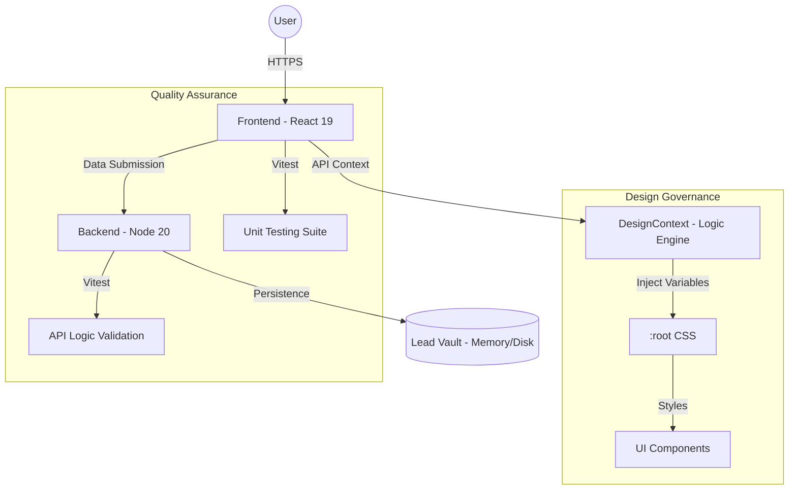
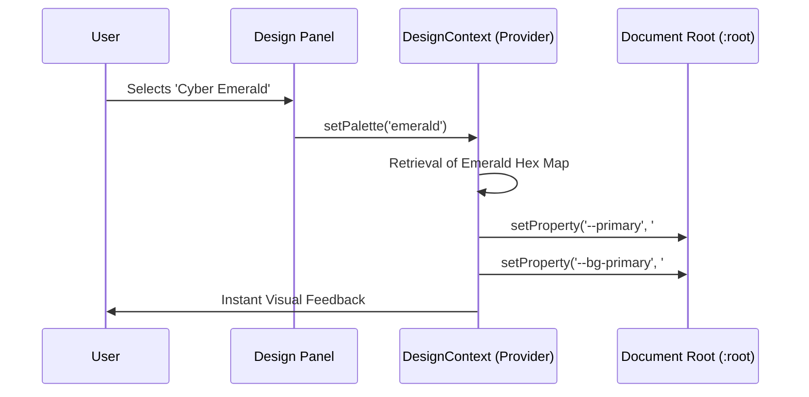
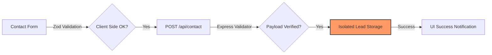

# Project Architecture Blueprint

This document outlines the high-level architecture, data flows, and technical standards of the project, serving as the north star for technical excellence and scalability.

## 1. System Overview

The project follows a modern monorepo architecture, separating concerns between a high-performance React 19 frontend and a secure Node.js 20 backend.

## 2. Design Engine Logic (Stratego Engine)

The core feature of the landing page is its dynamic customization engine. This sequence diagram illustrates how themes are applied in real-time without page reloads.

## 3. Lead Capture Lifecycle (Secure Pipeline)

Data security and integrity are paramount. All user submissions follow a strict validation and isolation protocol.

## 4. Technical Stack

| Layer          | Technology        | Purpose                                   |
| :------------- | :---------------- | :---------------------------------------- |
| **Frontend**   | React 19 + Vite   | High-performance UI rendering             |
| **Styling**    | Tailwind CSS 4    | Atomic CSS & Design System integration    |
| **State**      | React Context API | Theme and Global state management         |
| **Backend**    | Node 20 + Express | Lightweight, secure lead handling         |
| **Testing**    | Vitest + RTL      | Comprehensive unit & integration coverage |
| **Governance** | ESLint + Prettier | Automated code quality & formatting       |

## 5. Quality Control & Technical Standards

To maintain a "Zero-Noise" environment, the project adheres to the following engineering standards:

### 5.1 Documentation Governance

Every public-facing component, hook, or API utility must be documented using JSDoc/TSDoc.

- **Rules**: `jsdoc/require-jsdoc` and associated rules are set to `error` level.
- **Objective**: Ensure that the codebase is completely self-describing for future scalability.

### 5.2 Test-Driven Quality

We employ **Vitest** for unit and integration testing.

- **Frontend**: Components are tested for rendering across different translation keys and dynamic theme states.
- **Backend**: API routes are validated against Zod schemas and mocked I/O operations.

### 5.3 Automated Formatting

**Prettier** is integrated as the final layer of surface-level quality.

- **Configuration**: Standardized across the monorepo via `.prettierrc`.
- **Enforcement**: Automatic formatting on save and as part of the CI pipeline.

---

_Documented by Google DeepMind Advanced Agentic Coding Team - 2026_
